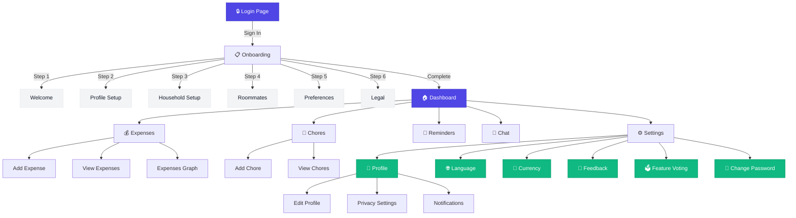

```mermaid
graph TD
    %% Authentication & Onboarding Flow
    A[🔒 Login Page] -->|Sign In| B[📋 Onboarding]
    B -->|Step 1| B1[Welcome]
    B -->|Step 2| B2[Profile Setup]
    B -->|Step 3| B3[Household Setup]
    B -->|Step 4| B4[Roommates]
    B -->|Step 5| B5[Preferences]
    B -->|Step 6| B6[Legal]
    B -->|Complete| C[🏠 Dashboard]

    %% Main Navigation
    C --> D1[💰 Expenses]
    C --> D2[🧹 Chores]
    C --> D3[📅 Reminders]
    C --> D4[💬 Chat]
    C --> D5[⚙️ Settings]

    %% Expenses Section
    D1 --> E1[Add Expense]
    D1 --> E2[View Expenses]
    D1 --> E3[Expenses Graph]

    %% Chores Section
    D2 --> F1[Add Chore]
    D2 --> F2[View Chores]

    %% Settings Section
    D5 --> S1[👤 Profile]
    D5 --> S2[🌐 Language]
    D5 --> S3[💱 Currency]
    D5 --> S4[📝 Feedback]
    D5 --> S5[🗳️ Feature Voting]
    D5 --> S6[🔑 Change Password]

    %% Profile Section
    S1 --> P1[Edit Profile]
    S1 --> P2[Privacy Settings]
    S1 --> P3[Notifications]

    %% Style Definitions
    classDef primary fill:#4f46e5,stroke:#4338ca,color:#ffffff
    classDef secondary fill:#f3f4f6,stroke:#e5e7eb,color:#111827
    classDef accent fill:#10b981,stroke:#059669,color:#ffffff

    %% Apply Styles
    class A,C primary
    class B1,B2,B3,B4,B5,B6 secondary
    class S1,S2,S3,S4,S5,S6 accent
``` 